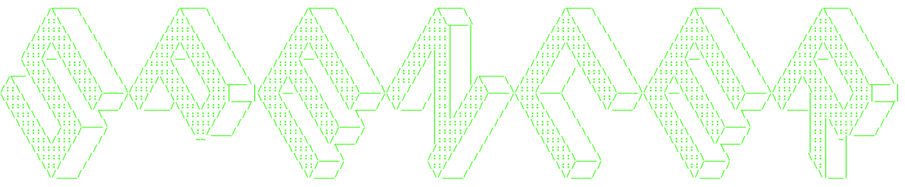

# Hi there 👋

Whatsup my fellow hackers.

<!--START_SECTION:readme-info-->
<!--END_SECTION:readme-info-->

<!-- 

  

 -->
<!--

Here are some ideas to get you started:

- 🔭 I’m currently working on ...
- 🌱 I’m currently learning ...
- 👯 I’m looking to collaborate on ...
- 🤔 I’m looking for help with ...
- 💬 Ask me about ...
- 📫 How to reach me: ...
- 😄 Pronouns: ...
- ⚡ Fun fact: ...
-->
